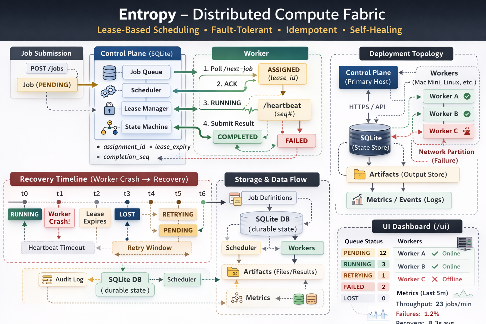
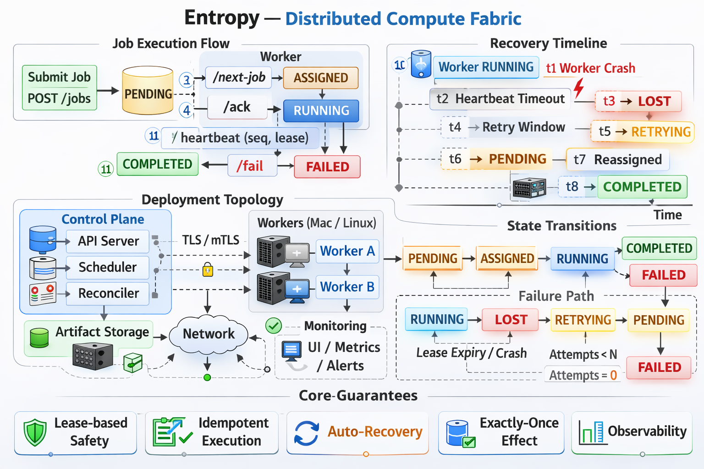

# Entropy

**Entropy is a partition-tolerant distributed compute fabric designed for unreliable infrastructure.**

It provides durable job scheduling, lease-based assignment, deterministic recovery,
and eventual consistency under:

- Power loss
- Worker crashes
- Network partitions
- Duplicate messages
- Out-of-order delivery
- Control-plane restarts

Entropy is designed for environments where infrastructure cannot be trusted.

---

# System Model

Entropy consists of two roles:

## Control Plane
- Durable SQLite-backed state
- Job queue & state machine
- Lease-based assignment
- Worker registration & capability tracking
- Reconciliation engine
- Retry & recovery transitions
- Structured audit events
- Metrics aggregation

## Worker Nodes
- Poll-based job acquisition
- Assignment ACK handshake
- Execution with timeout enforcement
- Artifact generation & checksum validation
- Heartbeat with monotonic sequence numbers
- Local replay buffer for reconnect
- Deterministic completion replay

---

# Core Guarantees

Entropy provides the following execution semantics:

### 1. No Duplicate Assignment
A job lease (`assignment_id`) ensures only one worker can legally complete a job.

Concurrent claims are prevented by serializable DB transactions.

### 2. Idempotent Completion
- `assignment_id` validation
- Monotonic `completion_seq`
- Terminal-state no-op protection

Duplicate completion messages do not corrupt state.

### 3. Crash Recovery
If a worker:
- Crashes
- Loses power
- Stops heartbeating

The control plane transitions:

RUNNING → LOST → RETRYING → PENDING → (reassigned)

Attempt counts increment safely and deterministically.

### 4. Control-Plane Restart Safety
- Durable SQLite state
- Immediate reconciliation sweep
- Stale leases reclaimed
- No orphaned RUNNING state

### 5. Eventual Consistency
Workers may:
- Replay completions
- Replay state on reconnect
- Resume after network partitions

Control plane reconciliation ensures final deterministic state.

---

# Execution Semantics

Entropy implements:

- At-least-once execution model
- Idempotent completion enforcement
- Lease-based execution safety
- Priority-aware scheduling
- Capability-based assignment
- Scheduled (delayed) job eligibility
- Retry concurrency controls
- High-priority preemption gates
- Queue aging fairness model

---

# Failure Model

Entropy explicitly handles:

| Failure | Behavior |
|----------|-----------|
| Worker crash | Job → LOST → RETRYING → PENDING |
| Power loss | Worker offline → lease expires → requeue |
| Network partition | Worker buffers completions → replay |
| Duplicate completion | Ignored safely |
| Out-of-order heartbeat | Sequence numbers discard stale updates |
| Control-plane restart | State restored + reconciliation sweep |

---

# Observability

Entropy provides:

- `GET /metrics`
- Structured audit events (`/events`)
- Worker liveness tracking
- Queue depth by status
- Retry & lost counters
- Completion/failure rate windows
- Lightweight UI dashboard

---

# Security Model

- Admin vs worker token separation
- Token rotation support
- Optional signed worker tokens
- Optional TLS
- Optional mTLS
- Worker command allowlists
- Working directory allowlists
- Optional non-root enforcement

---

# Real-World Use Case

Entropy is particularly suited for:

- GPU compute in unstable power environments
- Local multi-host clusters
- Home-lab distributed systems
- Academic distributed scheduling experiments
- Infrastructure failure simulations

---

# Architecture Overview

See:
- [ARCHITECTURE.md](ARCHITECTURE.md)
- [DESIGN_GUARANTEES.md](DESIGN_GUARANTEES.md)
- [SRS.md](SRS.md)
- [SRS_TEST_SCENARIOS.md](SRS_TEST_SCENARIOS.md)

---

# Design Philosophy

Entropy intentionally avoids:

- Kubernetes
- Distributed consensus systems
- External coordination layers
- Cloud dependencies

It focuses on:

Deterministic state transitions  
Lease-based safety  
Durable recovery  
Minimal moving parts  
Explicit failure modeling  

---

# Status

Entropy implements the full SRS specification including:

- Lease-based assignment
- Retry lifecycle
- Stale worker recovery
- Concurrency-safe claim logic
- Stress-tested recovery model
- Duplicate completion protection
- Dual-host recovery validation

---

Entropy is not a demo.

It is a small, production-grade distributed systems engine.
